# InventoryOS

🚀 [Live Demo](https://master.d1w3k4ui4is6ob.amplifyapp.com/dashboard)

InventoryOS is a **full-stack inventory management dashboard application** built with a modern tech stack. It provides businesses with an intuitive, responsive, and scalable solution to manage their products, sales, users, and expenses — all from a single platform.  

This project was developed to showcase advanced full-stack development skills, cloud deployment, and responsive UI/UX design.

---

## ✨ Features

- **Full-stack architecture** with separate client (Next.js) and server (Node.js/Express) for scalability.  
- **Light/Dark mode toggle** for personalized user experience.  
- **Six fully responsive pages**:
  1. **Dashboard** – Widgets for Popular Products, Sales Summary, Purchase Summary, Expense Summary, Sales & Discount, Dues & Pending Orders, Customers & Expenses (arranged using grid layout).
  2. **Inventory** – Tabular view of all products with ID, Name, Price, Rating, and Stock.
  3. **Products** – Card view of products with images and details. Supports **adding new products**, which reflects across all pages.
  4. **Users** – Table of employees with User ID, Name, and Email.
  5. **Settings** – Website configuration and settings page.
  6. **Expenses** – Track expenses by category and filter by start and end dates.
- **Responsive Design** – Optimized for small (mobile), medium (tablet), and large (desktop) screen sizes.  
- **Dynamic State Management** – Powered by Redux Toolkit and RTK Query for efficient API interactions.  
- **Interactive Data Visualizations** – Charts and graphs powered by Recharts.  

---

## 🛠️ Tech Stack

### Frontend
- [Next.js](https://nextjs.org/) – React framework for SSR and client-side rendering  
- [Redux Toolkit](https://redux-toolkit.js.org/) – State management  
- [RTK Query](https://redux-toolkit.js.org/rtk-query/overview) – Data fetching and caching  
- [Tailwind CSS](https://tailwindcss.com/) – Utility-first CSS framework  
- [Recharts](https://recharts.org/en-US/) – Charts for analytics and dashboards  
- [Material UI](https://mui.com/) – Tables and UI components  

### Backend
- [Node.js](https://nodejs.org/) – Backend runtime  
- [Express.js](https://expressjs.com/) – Web framework  
- [Prisma](https://www.prisma.io/) – ORM for database interactions  
- [PostgreSQL](https://www.postgresql.org/) – Relational database  

### Cloud & Deployment
- **AWS EC2** – Hosting backend services  
- **AWS RDS** – PostgreSQL database hosting  
- **AWS Amplify** – Frontend hosting (Next.js)  
- **AWS S3** – Storage for product images and static assets

---

## 🎬 Demo Video

You can watch a demo of InventoryOS [here](https://youtu.be/ApKvgl4U1Wk).

---

## 📸 Screenshots

| Dashboard | Inventory Page | Products Page |
|-----------|----------------|---------------|
| 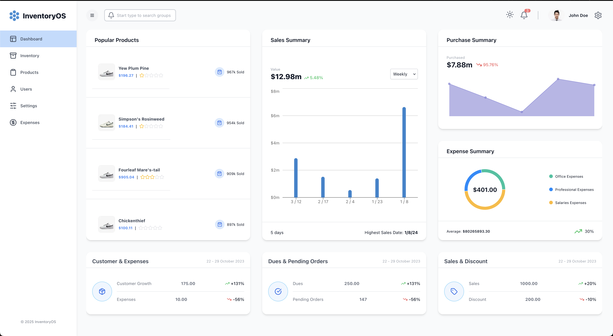 | 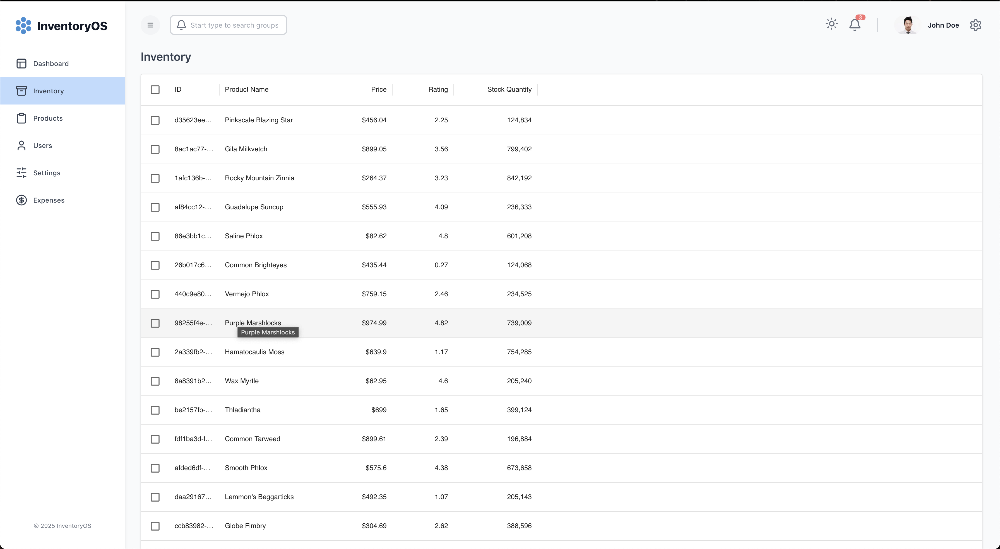 | 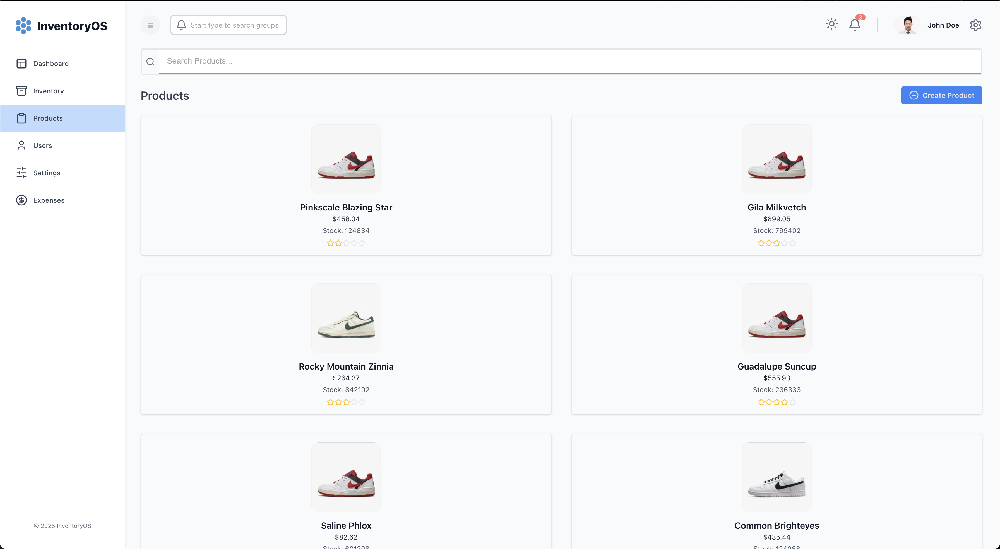 |

| Users Page | Settings Page | Expenses Page |
|------------|---------------|---------------|
| 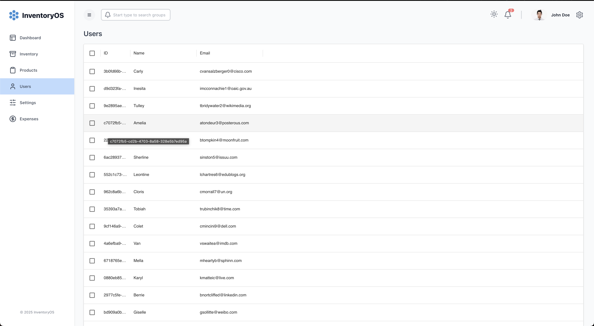 | 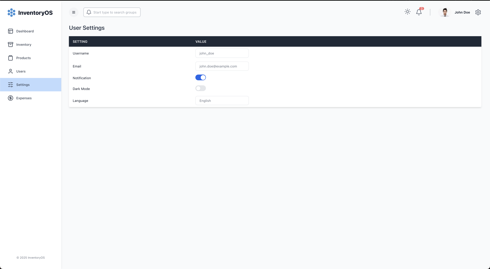 | 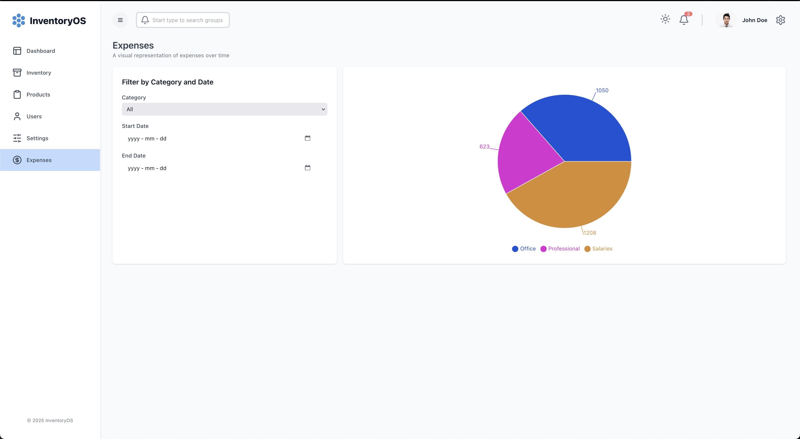 |

| Dashboard (Dark Mode) | Tablet View | Mobile View |
|------------|---------------|---------------|
| 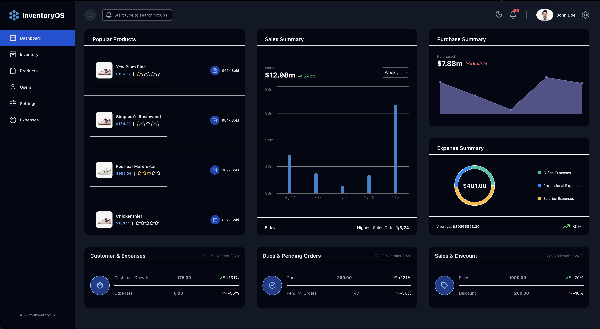 | 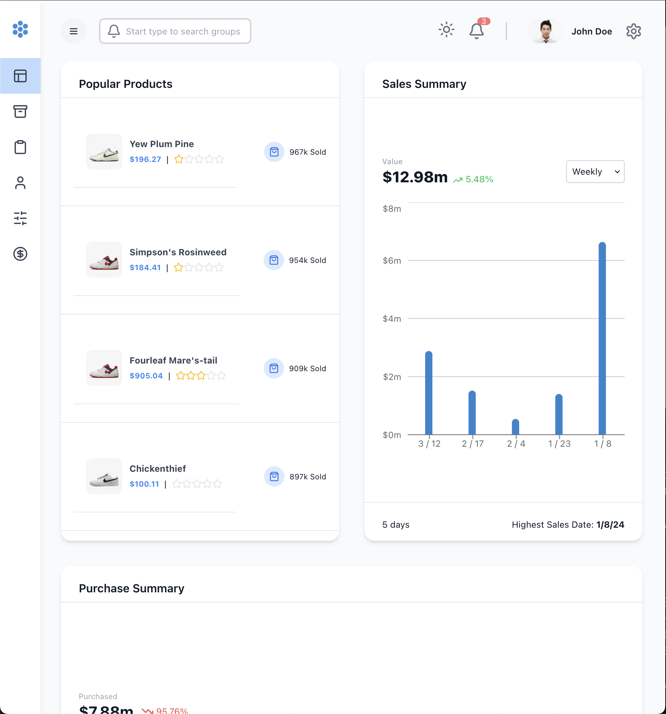 | 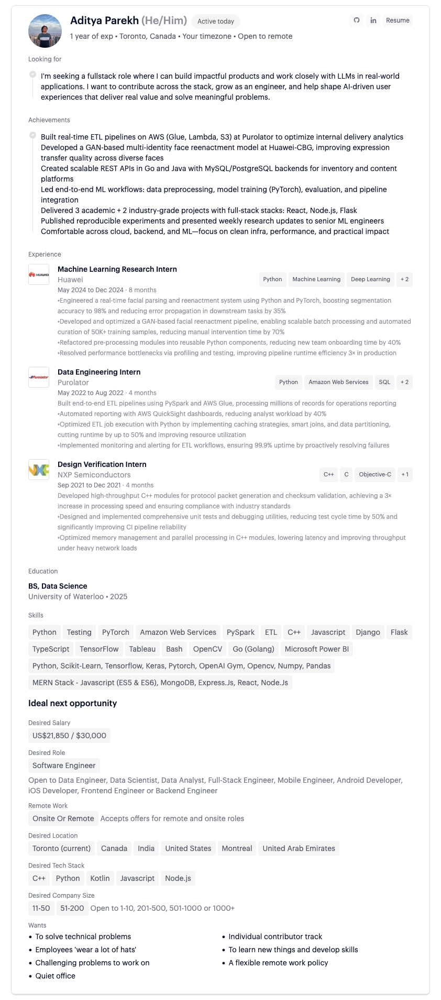 |

---

## ☁️ AWS Deployment Architecture

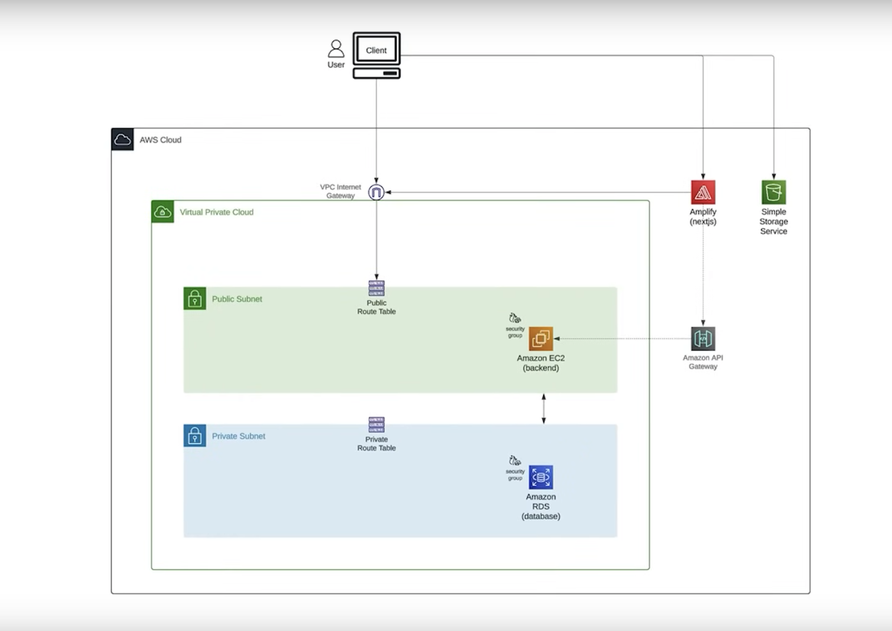

---

## 🗄️ Data Model Diagram


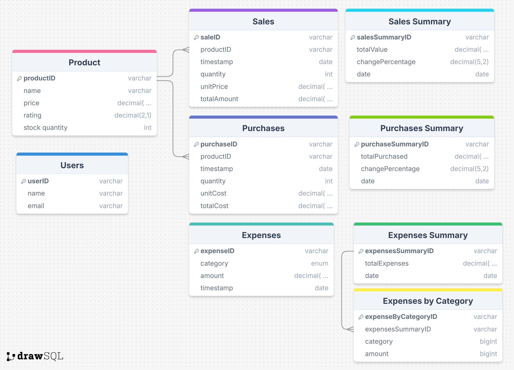

---

## 📂 Project Structure
```bash
InventoryOS
├── client/               # Frontend (Next.js)
│   └── src/
│       ├── app/          # Pages & UI components
│       └── state/        # Redux Toolkit & API
│
└── server/               # Backend (Node.js + Express)
    ├── prisma/           # Database schema & migrations
    └── src/              # Controllers, routes, and server entry
```
---

## 🚀 Getting Started

### Prerequisites
- Node.js (v18+)
- PostgreSQL database
- AWS account (for deployment)

### Setup Instructions

1. **Clone the repository**
   ```bash
   git clone https://github.com/your-username/InventoryOS.git
   cd InventoryOS
   ```
2. **Install dependencies**
   - **Frontend**
     ```bash
     cd client
     npm install
     ```
   - **Backend**
     ```bash
     cd server
     npm install
     ```
3. **Setup environment variables**
   Create `.env` files in both `client` and `server` directories with appropriate values (API URLs, database credentials, AWS keys, etc.).

4. **Run database migrations**
   ```bash
   cd server
   npx prisma migrate dev
   npx prisma db seed
   ```
5. **Start development servers**
   - **Backend**
     ```bash
     cd server
     npm run dev
     ```
   - **Frontend**
     ```bash
     cd client
     npm run dev
     ```
6. Open [localhost](http://localhost:3000) in your browser.

---

## 🌐 Deployment on AWS
- **Backend** → Deployed on EC2 with PM2 process manager  
- **Database** → Hosted on RDS PostgreSQL  
- **Frontend** → Deployed via Amplify with CI/CD integration  
- **Assets** → Stored in S3 bucket

---
